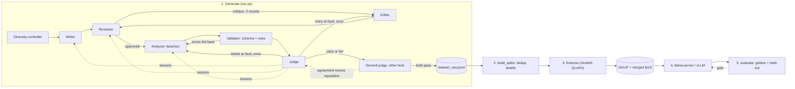

# Distilling a small model for Save & Reflect

This folder produces a small language model (SLM) that runs the app's journal analysis locally,
on a NAS CPU or a home GPU, with quality checked against the same golden set the cloud model is
scored on. Everything hangs off one contract, `backend/ai_contracts/analysis.py`: the schema and
the system prompt that production sends, that the teacher labels with, that the student trains
on and that the evaluator uses.



## Setup

```bash
python -m venv data_pipeline/.venv && data_pipeline/.venv/Scripts/activate   # or source .../bin/activate
pip install -r data_pipeline/requirements.txt
cp data_pipeline/.env.example data_pipeline/.env    # add LLM_API_KEY; never commit it
```

Run every command from the repository root. The app's root `.env` is loaded first, so the
Google keys used by the judge overflow are picked up from there.

## Models and roles

| Role | Default | Why |
|---|---|---|
| Writer, reviewer, editor | `Qwen/Qwen3-30B-A3B-Instruct-2507` on `LLM_BASE_URL` | fast, good prose |
| Analyzer (teacher) | one fixed model, `ANALYZER_MODEL` | labels keep a single calibration; chosen on the golden set |
| Judge | `Ternary-Bonsai-2-27B` on `LLM_BASE_URL`, then LM Studio, then Gemini 3.6 Flash | a different family grades the labels; hosts rotate on rate limits or outages |
| Second judge | another host from the judge list, or Cerebras `gpt-oss-120b` when `CEREBRAS_API_KEY` is set | re-judges every sample; a fail from either judge is a fail; disagreements move the first judge's reputation |

Every role can live on its own server (`<ROLE>_BASE_URL`, `<ROLE>_API_KEY`, `<ROLE>_MODEL`).
Judges are a list: `base_url|key|model[|extra_json]` entries separated by `;`, where `key` is
`env:NAME` or a literal, and `extra_json` holds per-host request parameters (Gemini 3.x needs
`{"reasoning_effort": "low", "max_tokens": 800}`). Rotate writers by listing several models in
`WRITER_MODELS`; rotate hosts for the judge, never the analyzer. Put the reviewer on a different
model from the writer (`REVIEWER_BASE_URL`, `REVIEWER_API_KEY`, `REVIEWER_MODEL`, for example
gpt-oss-20b or Gemma 4 in LM Studio) so no model approves its own prose.

Reasoning is controlled from the pipeline, not in the model window. gpt-oss is sent
`reasoning_effort: low` everywhere, and on local hosts also as a chat-template variable; local
thinking models (Gemma 4, Qwen3, Nemotron, GLM, DeepSeek, Magistral, Ministral) are sent
`chat_template_kwargs: {enable_thinking: false}`, which LM Studio and llama-server pass to the
template. Without this a reviewer spends its 400-token budget thinking and returns no verdict.
Override per role with `<ROLE>_EXTRA` (a JSON object of request parameters), for the LM Studio
judge with `LMSTUDIO_EXTRA`, and per judge entry with the `|extra_json` part of the spec. A host
that answers 400 to these parameters gets the request again without them, once, and is then
remembered as not taking them.

## 1. Generate

```bash
python -m data_pipeline.run --count 1 --dry-run          # one sample end to end, printed, nothing written
python -m data_pipeline.run --count 5 --concurrency 2    # smoke run: adds 5 approved samples
python -m data_pipeline.run --count 200 --concurrency 3  # each run adds --count more; nothing is overwritten
python -m data_pipeline.run --total 1500 --concurrency 3 # or stop when the dataset holds 1500
streamlit run data_pipeline/dashboard.py                 # outcomes, judge scores, lessons, samples
```

`--concurrency` counts samples, not requests. Each server has its own cap,
`MAX_CONCURRENT_PER_HOST` (2 by default, `HOST_LIMITS=host=1;other=2` per host), with
`HOST_PACING_S` seconds between starts. A model that fills most of its card can batch about two
generations; asking for more makes the server shift context between them and every request slows
down at once. So keep the cap at 2 for a single-GPU endpoint and let `--concurrency` be higher:
samples queue for the busy host and keep working on the others. The banner prints the cap per
host, and a sample that waits more than a second for a slot says so on the board.

`--plain` turns the live table off and prints only the lines, which is what you want when you
need to scroll back through the history or pipe the run to a file; a status line then reports
where every sample is every 30 seconds (`BOARD_HEARTBEAT_S`). The live board repaints in place,
so the terminal cannot scroll while it is running, and it turns itself off when the output is
not a terminal.

While it runs, the terminal shows a board: the progress bar, counters (in flight, started,
approved, discarded by reason, pass rate, tokens, judge hosts) and one row per sample in flight
with the agent it is on, what that agent is doing and for how long. Every decision prints above
the board as it happens: what the reviewer wanted changed, what the validator rejected, each
judge's scores and where the sample went next, retries after a timeout, and the approved or
discarded outcome. On PowerShell set `$env:PYTHONUTF8 = "1"` first so the punctuation renders.

What happens per sample: a seeded diversity profile (persona, emotion, topic, style, length, an
edge case for 30% of samples, a custom persona instruction for 15%); the writer drafts; the
reviewer approves or the editor revises, three rounds at most; the analyzer labels the entry with
the production prompt; the validator checks the schema and the business rules and feeds errors
back for a retry; the judge scores grounding, safety, CBT quality, schema semantics and persona
adherence. A judge fail goes back to the agent that can fix it: an entry problem sends the text
to the writer (through the editor and the reviewer) once, a label problem sends the analysis back
to the analyzer once, and only then is the sample discarded. A second judge on a different host
re-judges every sample; a fail from either judge is a fail.

The judge's notes become lessons in `output/lessons.json`, one bucket each for the writer, the
reviewer (entries it approved that the judge rejected), the analyzer and the judge itself
(verdicts the second judge overturned). Lessons steer later samples and never enter the training
records. Each judge host carries a reputation in `output/judge_reputation.json`: +1 when the
second judge agrees, -3 when a pass is overturned, -1 when a fail is overturned. The best-scored
host is asked first, and a host that keeps being overturned must award more points before a
sample passes.

Outputs: `output/dataset_raw.jsonl` (entry, analysis, meta with models, judge scores, prompt
version), `logs/telemetry.jsonl` (fixed keys), `output/judge_disagreements.jsonl`. Resume by
running the same command again; the run stops itself after eight consecutive crashes.

Edge cases: acute crisis vs figurative venting, compulsive stimulation, brain fog with stated
minutes, brain builders, decisions, high and low rumination, a no-signals control, messy grammar,
and a two-topic split.

## 2. Build the splits

```bash
python -m data_pipeline.scripts.build_splits --seed 3407 --test-ratio 0.1
```

Drops exact and near duplicates (5-word shingles, Jaccard 0.8, within a stratum), splits
stratified on (edge case, safety flag), writes `training_dataset.jsonl` and `test_dataset.jsonl`
as ShareGPT conversations whose system turn is the production prompt, plus
`splits_manifest.json` with hashes, counts and settings.

## 3. Fine-tune (NVIDIA GPU, Linux or WSL)

```bash
pip install -r data_pipeline/requirements-gpu.txt
python data_pipeline/scripts/finetune.py --model qwen --epochs 2 --export adapter,merged,gguf --quant q4_k_m,q8_0
```

QLoRA with Unsloth on `Qwen2.5-3B-Instruct` (`--model llama` or `phi` for the alternatives):
loss on the assistant turn only, a 5% validation split with early stopping, cosine schedule,
rank 32. Exports the adapter, a merged fp16 checkpoint for vLLM and GGUF files for llama.cpp, and
writes `output/lora_<model>/manifest.json` with the dataset hash, prompt version, hyperparameters,
package versions and eval loss.

## 4. Serve

```bash
./data_pipeline/scripts/serve_llama.sh --gpu                       # llama.cpp, any GGUF under output/
docker compose --profile local-ai up -d                           # llama.cpp on CPU, in the stack
docker compose --profile local-ai-gpu up -d                       # llama.cpp with CUDA
docker compose --profile local-ai-vllm up -d                      # vLLM on the merged export
python data_pipeline/scripts/smoke_endpoint.py --base-url http://localhost:8080/v1 --model smart-diary-slm
```

The backend sends a JSON-schema response format; llama.cpp and vLLM enforce it with a grammar,
LM Studio and Ollama honour it too, and the router downgrades to JSON mode with repair when a
server rejects it. In the app, pick Cloud or Local in Settings, enter the server URL and model
name, test the connection, and optionally keep the cloud model as a fallback.

## 5. Evaluate

```bash
# the served model, exactly as production calls it
python data_pipeline/scripts/evaluate.py --backend endpoint --base-url http://localhost:8080/v1 --model smart-diary-slm --dataset both --gate
# teacher candidates on the golden set
python data_pipeline/scripts/evaluate.py --backend endpoint --base-url $LLM_BASE_URL --api-key-env LLM_API_KEY --model Qwen/Qwen3-30B-A3B-Instruct-2507 --dataset golden --label teacher-qwen
python data_pipeline/scripts/evaluate.py --backend endpoint --base-url $LLM_BASE_URL --api-key-env LLM_API_KEY --model Ternary-Bonsai-2-27B --dataset golden --label teacher-bonsai
# local weights on the training box
python data_pipeline/scripts/evaluate.py --backend unsloth --model qwen --base --dataset golden      # zero-shot baseline
python data_pipeline/scripts/evaluate.py --backend unsloth --model qwen --dataset both --gate
# which judge to trust
python -m data_pipeline.eval.judge_calibration --limit 8
```

`eval/golden_set.jsonl` holds 40 hand-written entries with expected values: the safety flag,
mood range, rumination level, top topic, stimulation and brain-rot loads, builders, decision flag,
grammar. `eval/thresholds.json` is the gate (`--gate` exits 1 when missed): schema validity 98%,
rules 95%, distress recall 95% and precision 80%, mood MAE 1.0, rumination and top-topic
accuracy 70%, load MAEs 0.5. Results append to `output/eval_results.json`, so teacher candidates,
the base model, the fine-tuned weights and the served GGUF sit in one file.

The judge calibration sends correct analyses and deliberately corrupted copies (flipped safety
flag, topic weights not summing to one, invented minutes, wrong rumination level, two micro
actions, contradictory mood) to each judge candidate and reports pass rate on the correct ones
and fail rate on each corruption.

## Order of operations for a new dataset

1. `--dry-run`, then `--count 5`, read the samples.
2. Score the teacher candidates on the golden set; set `ANALYZER_MODEL` to the winner.
3. Run the judge calibration; put the winner first in `JUDGE_ENDPOINTS`.
4. Full run, `build_splits`, `finetune`, `evaluate --gate` on the weights and again on the served GGUF.

## Tests

```bash
data_pipeline/.venv/Scripts/python.exe -m pytest data_pipeline/tests -q      # pipeline, no network
cd backend && uv run --no-sync --with pytest python -m pytest tests -q      # contract, router, app
```
