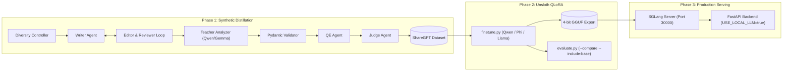

# 🧪 SLM Distillation, Fine-Tuning & Deployment Pipeline

An end-to-end, multi-agent synthetic data distillation and fine-tuning pipeline for **Smart Diary**. It replaces expensive frontier cloud API calls (e.g. GPT-4o) with an optimized, privacy-first, self-hosted Small Language Model (SLM) running on SGLang.

---

## 🏗️ Architecture: 3-Phase Lifecycle



---

## ⚡ Quick Start

### 1. Installation

For data generation (runs on CPU or Mac):
```bash
cd data_pipeline
pip install -r requirements.txt
```

For model fine-tuning (requires an NVIDIA GPU instance, e.g. RunPod, Colab):
```bash
cd data_pipeline
pip install -r requirements-gpu.txt
```

### 2. Environment Configuration

Copy the example `.env`:
```bash
cp .env.example .env
```
Configure your credentials in `.env`:
```env
LLM_API_KEY="your-openrouter-or-together-key"
LLM_BASE_URL="https://openrouter.ai/api/v1"

# Models for the multi-agent generation loop
WRITER_MODEL="qwen/qwen3-30b-a3b-instruct"
EDITOR_MODEL="qwen/qwen3-30b-a3b-instruct"
QE_MODEL="qwen/qwen3-30b-a3b-instruct"
REVIEWER_MODEL="google/gemma-2-9b-it"
ANALYZER_MODEL="google/gemma-2-9b-it"
JUDGE_MODEL="google/gemma-2-9b-it"
```

---

## 🚀 Phase 1: Autonomous Data Distillation

Run the asynchronous multi-agent pipeline to generate gold-standard training data:

```bash
# Generate 100 approved samples with dynamic AIMD concurrency
python run.py --count 100 --concurrency auto

# Prioritize edge cases (crisis safety flags, compulsive behaviors, brain fog)
python run.py --count 50 --force-edge-cases
```

### Key Features:
- **AIMD Dynamic Concurrency:** Automatically scales concurrent workers up on clean API responses and slashes workers by 50% upon HTTP 429 rate limits.
- **Smart Resume:** Reads existing output files on startup to avoid re-generating or over-producing.
- **Self-Healing JSON:** Integrated `json-repair` intercepts imperfect JSON from open-source models before validation.
- **Live Streamlit Dashboard:** Monitor throughput, cost, pass/rejection rates, and inspect rejected samples in real-time:
  ```bash
  streamlit run dashboard.py
  ```

Output dataset splits are saved to:
- `output/training_dataset.jsonl` (90% training split)
- `output/test_dataset.jsonl` (10% holdout test split)

---

## 🎯 Phase 2: Unsloth Fine-Tuning & Multi-Model Shootout

Fine-tune candidate 3B-class base models on an NVIDIA GPU environment using Unsloth QLoRA:

```bash
# Fine-tune Qwen 2.5 3B Instruct
python scripts/finetune.py --model qwen --epochs 1

# Fine-tune Phi-3.5 Mini (3.8B) Instruct
python scripts/finetune.py --model phi --epochs 1

# Fine-tune Llama 3.2 3B Instruct
python scripts/finetune.py --model llama --epochs 1
```

Each run outputs:
1. LoRA adapter weights in `output/lora_<model>/`
2. Merged 4-bit quantized GGUF in `output/model_<model>_q4_k_m/unsloth.Q4_K_M.gguf`

### Model Evaluation & Baseline Comparison:

Run a scientific head-to-head comparison on the holdout test set to measure strict schema compliance and latency, comparing fine-tuned models against zero-shot baselines:

```bash
# Compare all 3 models head-to-head including base models (6-way shootout)
python scripts/evaluate.py --compare --include-base --limit 100

# Benchmark a single fine-tuned model against its zero-shot baseline
python scripts/evaluate.py --model qwen --include-base --limit 50
```

Results and per-field schema accuracy are printed in a terminal table and saved to `output/eval_results.json`.

---

## 🚢 Phase 3: Production Inference (SGLang)

### Standalone Server
Launch the SGLang server locally or on your GPU server:
```bash
./scripts/serve_sglang.sh qwen
```
This serves an OpenAI-compatible API on `http://localhost:30000/v1` with **RadixAttention** (prompt caching) and Guided JSON decoding.

### Docker Compose Deployment
The main `docker-compose.yml` includes an opt-in profile for SGLang:

```bash
# Boot the entire stack with local GPU inference:
docker compose --profile local-ai up -d
```

### Full Backend Integration
Set in your root `.env`:
```env
USE_LOCAL_LLM=true
LOCAL_LLM_BASE_URL=http://localhost:30000/v1
```
When `USE_LOCAL_LLM=true`, all backend features (Diary Analysis, Chat, Insights, Guided Meditations, and Decision Agent) are routed through the local SGLang container with 100% data privacy.
